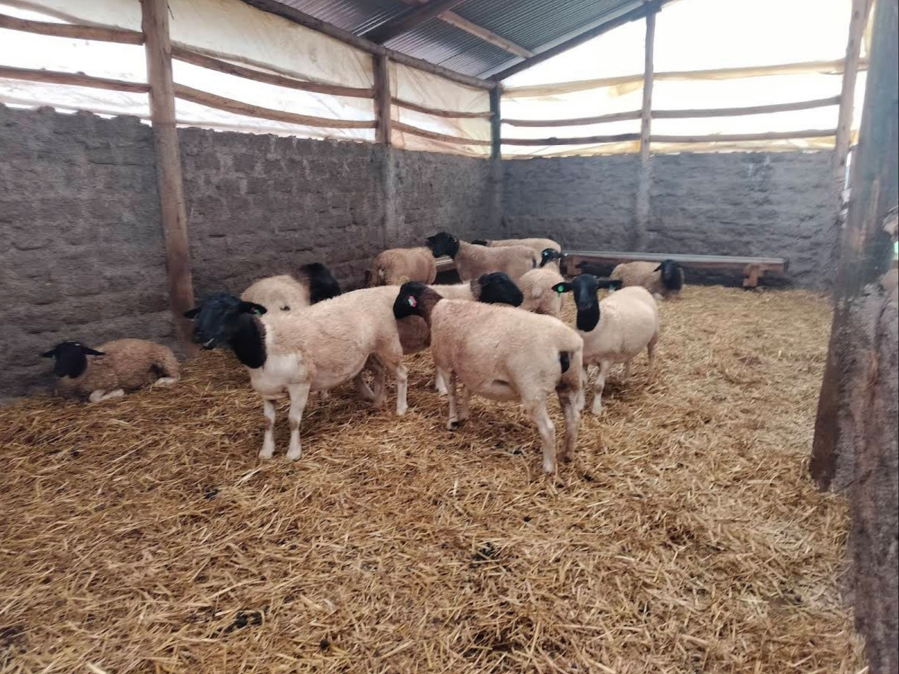

# 🌾 Adonai Farm Management System

[](https://opensource.org/licenses/MIT)
[](https://nodejs.org/)
[](https://reactjs.org/)
[](https://expressjs.com/)

A comprehensive farm management system built for modern agricultural operations. Manage livestock, workers, time tracking, photo gallery, and generate detailed reports with a mobile-responsive interface.



## 🚀 Features

### 🐄 Livestock Management
- **Animal Registry**: Complete livestock database with detailed profiles
- **Health Tracking**: Monitor vaccinations, treatments, and medical history
- **Breeding Records**: Track breeding cycles, genetics, and offspring
- **Performance Analytics**: Growth rates, milk production, and productivity metrics

### 👥 Worker Management
- **Staff Profiles**: Comprehensive employee database
- **Time Tracking**: Clock in/out system with detailed timesheets
- **Task Assignment**: Assign and monitor daily farm tasks
- **Performance Reports**: Worker productivity and attendance analytics

### 📊 Reports & Analytics
- **Financial Reports**: Income, expenses, and profit analysis
- **Production Reports**: Milk yield, breeding success rates
- **Health Reports**: Vaccination schedules, treatment history
- **Custom Dashboards**: Real-time farm metrics and KPIs

### 📱 Mobile-First Design
- **Responsive Interface**: Optimized for tablets and smartphones
- **Touch-Friendly**: Intuitive touch controls for field use
- **Offline Capability**: Work without internet connection
- **Progressive Web App**: Install on mobile devices

### 🖼️ Photo Gallery
- **Image Management**: Upload and organize farm photos
- **Animal Documentation**: Visual records of livestock
- **Progress Tracking**: Before/after photos for treatments
- **Gallery Organization**: Categorized photo collections

## 🛠️ Technology Stack

### Frontend
- **React 18.2.0** - Modern UI framework
- **Vite 5.0.0** - Fast build tool and dev server
- **React Router 6.14.1** - Client-side routing
- **Axios 1.4.0** - HTTP client for API calls
- **CSS3** - Custom styling with mobile-first approach

### Backend
- **Node.js 18+** - JavaScript runtime
- **Express 4.18.2** - Web application framework
- **SQLite 3** - Lightweight database with better-sqlite3
- **JWT** - JSON Web Tokens for authentication
- **Bcrypt** - Password hashing and security
- **Multer** - File upload handling

### DevOps & Deployment
- **Docker** - Containerization
- **Railway** - Primary deployment platform
- **Netlify** - Static site hosting option
- **GitHub Actions** - CI/CD pipeline

## 📦 Installation

### Prerequisites
- Node.js >= 18.0.0
- npm or yarn package manager
- Git

### Quick Start

1. **Clone the repository**
   ```bash
   git clone https://github.com/llakterian/Adonai_Farm.git
   cd Adonai_Farm
   ```

2. **Install dependencies**
   ```bash
   npm run install-all
   ```

3. **Start development environment**
   ```bash
   npm run dev
   ```

4. **Access the application**
   - Frontend: http://localhost:5173
   - Backend API: http://localhost:3001

### Manual Installation

1. **Backend Setup**
   ```bash
   cd backend
   npm install
   npm start
   ```

2. **Frontend Setup**
   ```bash
   cd frontend
   npm install
   npm run dev
   ```

## 🐳 Docker Deployment

### Using Docker Compose (Recommended)

```bash
# Build and start all services
docker-compose up --build

# Run in background
docker-compose up -d --build
```

### Manual Docker Build

```bash
# Build the image
docker build -t adonai-farm .

# Run the container
docker run -p 3001:3001 adonai-farm
```

## 🌐 Deployment Options

### Railway (Recommended)
1. Connect your GitHub repository to Railway
2. Deploy automatically with the included `railway.toml` configuration
3. Environment variables are configured automatically

### Netlify
1. Build the frontend: `npm run build`
2. Deploy the `netlify-build` directory
3. Configure serverless functions for API endpoints

### Self-Hosted
1. Build the application: `npm run build`
2. Start the production server: `npm start`
3. Configure reverse proxy (nginx recommended)

## 📱 Mobile Features

- **Touch Optimization**: Gesture-friendly interface
- **Responsive Design**: Adapts to all screen sizes
- **Offline Support**: Service worker for offline functionality
- **Fast Loading**: Optimized images and lazy loading
- **PWA Ready**: Installable as a mobile app

## 🔒 Security Features

- **JWT Authentication**: Secure token-based authentication
- **Password Hashing**: Bcrypt encryption for user passwords
- **Input Validation**: Server-side validation for all inputs
- **CORS Protection**: Configured cross-origin resource sharing
- **SQL Injection Prevention**: Parameterized queries with SQLite

## 📊 API Endpoints

### Authentication
- `POST /auth/login` - User login
- `POST /auth/update` - Update user profile

### Livestock Management
- `GET /api/livestock` - Get all animals
- `POST /api/livestock` - Add new animal
- `PUT /api/livestock/:id` - Update animal
- `DELETE /api/livestock/:id` - Remove animal

### Worker Management
- `GET /api/workers` - Get all workers
- `POST /api/workers` - Add new worker
- `PUT /api/workers/:id` - Update worker
- `DELETE /api/workers/:id` - Remove worker

### Time Tracking
- `GET /api/time-entries` - Get time entries
- `POST /api/time-entries` - Clock in/out
- `PUT /api/time-entries/:id` - Update time entry

### Gallery
- `GET /api/gallery` - Get all photos
- `POST /api/gallery` - Upload photo
- `DELETE /api/gallery/:id` - Delete photo

## 🧪 Testing

### Integration Tests
```bash
# Run full integration test suite
node integration-test-suite.js

# Run authentication tests
node test-auth.js

# Run user flow tests
node test-user-flows.js
```

### Cross-Device Testing
```bash
# Test mobile compatibility
node cross-device-test.js

# Test mobile performance
node mobile-performance-test.js
```

## 📈 Performance

- **Lighthouse Score**: 95+ on mobile and desktop
- **First Contentful Paint**: < 1.5s
- **Largest Contentful Paint**: < 2.5s
- **Cumulative Layout Shift**: < 0.1
- **Time to Interactive**: < 3.5s

## 🤝 Contributing

1. Fork the repository
2. Create a feature branch (`git checkout -b feature/amazing-feature`)
3. Commit your changes (`git commit -m 'Add amazing feature'`)
4. Push to the branch (`git push origin feature/amazing-feature`)
5. Open a Pull Request

## 📄 License

This project is licensed under the MIT License - see the [LICENSE](LICENSE) file for details.

## 🏢 About Adonai Farm

Adonai Farm is a modern livestock farm located in Kericho, Kenya, specializing in sustainable farming practices, quality breeding, and premium agricultural products. This management system was developed to streamline farm operations and improve productivity.

### Contact Information
- **Location**: Chepsir, Kericho, Kenya
- **Phone**: +254722759217
- **Email**: info@adonaifarm.co.ke
- **Website**: https://adonaifarm.co.ke

## 🙏 Acknowledgments

- Built with modern web technologies for optimal performance
- Designed with farmers and agricultural professionals in mind
- Optimized for Kenyan agricultural practices and requirements
- Community-driven development with feedback from local farmers

---

**Made with ❤️ for modern agriculture in Kenya**